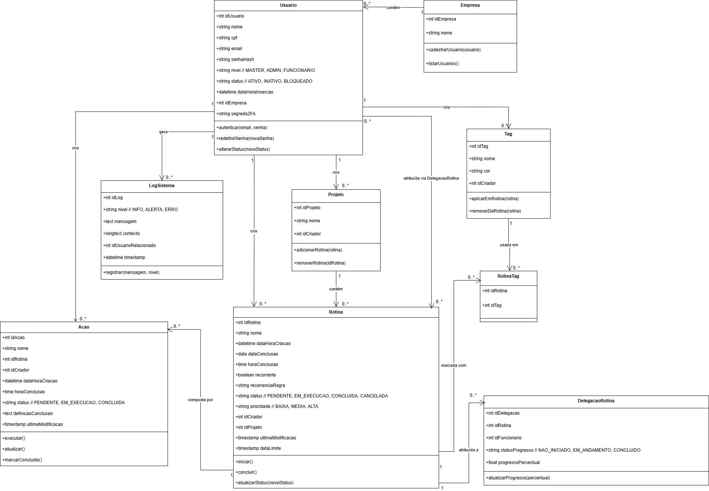
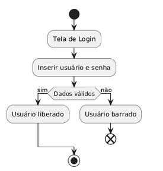
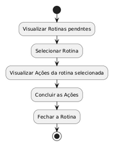
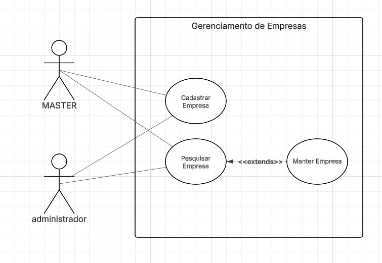

## **Introdução**

O projeto é um **Gerenciador de Rotinas Empresariais**, desenvolvido com o objetivo de facilitar a organização, acompanhamento e execução das atividades internas de uma empresa.
A plataforma permite que **gerentes e supervisores** criem, atribuam e monitorem rotinas de trabalho para seus colaboradores, garantindo maior controle operacional e melhor distribuição das demandas diárias.

Com ele, é possível:
* Criar rotinas e tarefas de forma estruturada.
* Atribuir atividades a funcionários específicos.
* Definir **tempo estimado** para execução.
* Estabelecer **datas limites** de entrega.
* Acompanhar o progresso das rotinas em tempo real.

O sistema foi projetado para melhorar a comunicação interna, aumentar a produtividade e reduzir falhas operacionais, centralizando todas as rotinas em um único ambiente de gestão.

---

## **Modelos e Diagramas do Sistema**

Para representar a estrutura e o comportamento do Gerenciador de Rotinas Empresariais, foram elaborados diversos **diagramas UML** que oferecem uma visão clara e organizada dos componentes do sistema e de suas interações.

Esses diagramas auxiliam na compreensão técnica do projeto, permitindo visualizar desde a lógica interna das classes até o fluxo de execução das rotinas.
A seguir, estão descritos os principais modelos utilizados:

* **Diagrama de Classes:**
  Representa a estrutura estática do sistema, detalhando entidades, atributos, métodos e os relacionamentos entre elas.

* **Diagrama de Sequência:**
  Demonstra a comunicação entre objetos ao longo do tempo, ilustrando a ordem das operações em um determinado fluxo de uso.

* **Diagrama de Atividade:**
  Descreve o fluxo de processos e decisões dentro do sistema, permitindo entender como as rotinas e tarefas são executadas do início ao fim.

* **Diagrama de Caso de Uso:**
  Apresenta as interações entre os usuários (atores) e o sistema, destacando as funcionalidades principais e como cada perfil utiliza a aplicação.

Esses modelos contribuem para uma documentação completa e facilitam futuras manutenções, expansões e integrações do sistema.

---

# Diagrama de Classes

Abaixo está o **Diagrama de Classes** e a descrição técnica das classes, atributos, métodos e relacionamentos extraídos do diagrama.

---

## Resumo das classes, atributos e métodos

### `Usuario`

* **Atributos**

  * `int idUsuario`
  * `string nome`
  * `string cpf`
  * `string email`
  * `string senhaHash`
  * `string nivel` // `MASTER`, `ADMIN`, `FUNCIONARIO`
  * `string status` // `ATIVO`, `INATIVO`, `BLOQUEADO`
  * `datetime dataHoraInsercao`
  * `int idEmpresa`
  * `string segredo2FA`
* **Métodos**

  * `autenticar(email, senha)`
  * `redefinirSenha(novaSenha)`
  * `alterarStatus(novoStatus)`

---

### `Empresa`

* **Atributos**

  * `int idEmpresa`
  * `string nome`
* **Métodos**

  * `cadastrarUsuario(usuario)`
  * `listarUsuarios()`

**Relação:** `Empresa` contém 0..* `Usuario` (uma empresa possui vários usuários).

---

### `Projeto`

* **Atributos**

  * `int idProjeto`
  * `string nome`
  * `int idCriador`
* **Métodos**

  * `adicionarRotina(rotina)`
  * `removerRotina(idRotina)`

**Relação:** `Usuario` (criador) → cria 0..*`Projeto`. `Projeto` contém 0..* `Rotina`.

---

### `Rotina`

* **Atributos**

  * `int idRotina`
  * `string nome`
  * `datetime dataHoraCriacao`
  * `date dataConclusao`
  * `time horaConclusao`
  * `boolean recorrente`
  * `string recorrenciaRegra`
  * `string status` // `PENDENTE`, `EM_EXECUCAO`, `CONCLUIDA`, `CANCELADA`
  * `string prioridade` // `BAIXA`, `MEDIA`, `ALTA`
  * `int idCriador`
  * `int idProjeto`
  * `timestamp ultimaModificacao`
  * `timestamp dataLimite`
* **Métodos**

  * `iniciar()`
  * `concluir()`
  * `atualizarStatus(novoStatus)`

**Relações importantes:**

* `Rotina` é **composta por** 0..* `Acao`.
* `Rotina` —< `RotinaTag` >— `Tag` (associação N:N via `RotinaTag`).
* `Rotina` pode ser **atribuída** a usuários via `DelegacaoRotina` (delegação).

---

### `Acao`

* **Atributos**

  * `int idAcao`
  * `string nome`
  * `int idRotina`
  * `int idCriador`
  * `datetime dataHoraCriacao`
  * `time horaConclusao`
  * `string status` // `PENDENTE`, `EM_EXECUCAO`, `CONCLUIDA`
  * `text definicaoConclusao`
  * `timestamp ultimaModificacao`
* **Métodos**

  * `executar()`
  * `atualizar()`
  * `marcarConcluida()`

---

### `Tag`

* **Atributos**

  * `int idTag`
  * `string nome`
  * `string cor`
  * `int idCriador`
* **Métodos**

  * `aplicarEmRotina(rotina)`
  * `removerDeRotina(rotina)`

**Relação:** usada em 0..* `Rotina` via `RotinaTag`.

---

### `RotinaTag` (entidade associativa)

* **Atributos**

  * `int idRotina`
  * `int idTag`
* **Observação:** tabela de ligação N:N entre `Rotina` e `Tag`.

---

### `DelegacaoRotina`

* **Atributos**

  * `int idDelegacao`
  * `int idRotina`
  * `int idFuncionario` (usuário ao qual a rotina foi atribuída)
  * `string statusProgresso` // `NAO_INICIADO`, `EM_ANDAMENTO`, `CONCLUIDO`
  * `float progressoPercentual`
* **Métodos**

  * `atualizarProgresso(percentual)`

**Relação:** relaciona `Rotina` ↔ `Usuario` (funcionário) — permite delegar rotinas e acompanhar progresso por usuário.

---

### `LogSistema`

* **Atributos**

  * `int idLog`
  * `string nivel` // `INFO`, `ALERTA`, `ERRO`
  * `text mensagem`
  * `longtext contexto`
  * `int idUsuarioRelacionado`
  * `datetime timestamp`
* **Métodos**

  * `registrar(mensagem, nivel)`

**Relação:** `LogSistema` é gerado por ações de `Usuario` e outros eventos do sistema.

---

## Observações sobre relacionamentos e multiplicidades (resumo)

* `Empresa (1)` contém `Usuario (0..*)`.
* `Usuario (1)` cria `Projeto (0..*)`.
* `Projeto (1)` contém `Rotina (0..*)`.
* `Rotina (1)` é composta por `Acao (0..*)`.
* `Rotina (0..*)` ↔ `Tag (0..*)` via `RotinaTag` (N:N).
* `Rotina (0..*)` ↔ `Usuario (funcionário)` via `DelegacaoRotina` (N:N com atributos de progresso).
* `LogSistema` se relaciona com `Usuario` (opcionalmente referente ao usuário que originou o log).

---

## **Diagrama de Atividade — Processo de Login**

### **Visão Geral**

O diagrama de atividade abaixo representa o fluxo básico do processo de autenticação de um usuário no sistema. Ele descreve, passo a passo, como ocorre a interação desde o momento em que o usuário acessa a tela inicial de login até o resultado final da validação das credenciais.

Esse fluxo garante que apenas usuários com **dados corretos e válidos** possam acessar o sistema, enquanto credenciais incorretas resultam na interrupção imediata do processo.

### **Imagem do Diagrama**

---

## **Descrição detalhada do fluxo**

### **I. Início do Processo**

Tudo começa com o ponto inicial do fluxo, representado pelo nó negro (●).
Este nó indica o início da atividade de autenticação.

---

### **II. Acesso à Tela de Login**

O usuário é direcionado para a **Tela de Login**, onde poderá inserir suas credenciais.
Essa etapa representa a chegada do usuário na interface destinada à autenticação.

---

### **III. Inserção de Usuário e Senha**

Nesta atividade, o usuário informa:

* **Nome de usuário / e-mail**
* **Senha correspondente**

Essa etapa é essencial para que o sistema tenha dados suficientes para validar a identidade do usuário.

---

### **IV. Validação das Credenciais**

Após a entrada dos dados, o fluxo chega ao **ponto de decisão**.
Aqui o sistema verifica duas informações fundamentais:

* O e-mail/usuário existe no sistema?
* A senha fornecida corresponde à senha armazenada?

Com base nessa verificação, dois caminhos possíveis são definidos.

---

### **V. Caminho positivo — Dados válidos**

Caso as informações estejam corretas, o fluxo segue para **“Usuário liberado”**, significando que:

* As credenciais são válidas;
* O usuário está autorizado a acessar o sistema;
* O fluxo segue para o estado final de conclusão.

Isso representa o acesso concedido.

---

### **VI. Caminho negativo — Dados inválidos**

Se a validação falhar, o fluxo segue para **“Usuário barrado”**, representando que:

* O usuário digitou dados incorretos;
* O sistema impede o acesso;
* O fluxo é encerrado com o símbolo de cancelamento (✖).

Essa ação protege a segurança do sistema contra acessos indevidos.

---

### **VII. Finalização do Processo**

Cada caminho termina em um nó de fim apropriado:

* **Concluído** quando o login é bem-sucedido.
* **Cancelado** quando as credenciais estão incorretas.

Essa separação deixa claro o resultado final do processo.

---

## **Diagrama de Atividade — Criação / Edição de Usuário**

### **Imagem do Diagrama**

---

### **Visão Geral**

Este diagrama descreve o fluxo de criação e edição de usuários no sistema. Ele contempla dois caminhos principais que partem de uma mesma interface inicial: **Criar novo usuário** e **Pesquisar/editar usuário existente**. Ambos os caminhos convergem para a etapa de salvar as alterações no sistema e envio de confirmação.

O objetivo do fluxo é garantir que gestores ou administradores possam cadastrar novos colaboradores e também localizar e atualizar usuários já existentes, mantendo consistência dos dados e gerando confirmação (e.g., e-mail, notificação interna) após a operação.

---

### **Fluxo detalhado (passo a passo)**

### **I. Início**

   * Ponto inicial: a ação é iniciada por um usuário com permissão (por exemplo: administrador ou gerente).
   * Pré-condição: usuário autenticado e com permissão adequada para criar/editar usuários.

### **II. Decisão inicial — Criar ou Pesquisar?**

   * Interface apresenta a opção de **Criar** novo usuário ou **Pesquisar** um usuário já cadastrado.
   * Com base na escolha, o fluxo segue por duas trilhas distintas: criação (esquerda) ou pesquisa/edição (direita).

### **III. Trilha: Criar Usuário**

   * **Ir para a criação de usuário**: o sistema redireciona para o formulário de cadastro.
   * **Preencher dados do usuário**: campos típicos:

     * Nome completo
     * CPF (ou outro identificador)
     * E-mail
     * Empresa / Filial
     * Nível/permissão (MASTER, ADMIN, FUNCIONARIO)
     * Status inicial (ATIVO/INATIVO)
     * Dados opcionais (telefone, setor, cargo)
   * Validações imediatas no front-end (formato de e-mail, máscara de CPF) e checagens no backend (CPF/e-mail já cadastrados).
   * Ao terminar, o fluxo converge para **Salvar no sistema**.

### **IV. Trilha: Pesquisar → Editar Usuário**

   * **Ir para a pesquisa de usuário**: o sistema mostra a tela de busca/filtragem.
   * **Inserir parâmetros de pesquisa**: possíveis parâmetros: nome, CPF, e-mail, empresa, nível.
   * **Selecionar um usuário**: a lista de resultados permite escolher o registro a editar.
   * **Ir para a edição do usuário selecionado**: abrir o formulário preenchido com os dados atuais.
   * **Preencher/alterar dados do usuário**: o administrador faz as alterações necessárias (mesmos campos da criação).
   * Após a edição, o fluxo converge para **Salvar no sistema**.

### **V. Salvar no Sistema**

   * Operação transacional: todas as alterações devem ser salvas de forma atômica (rollback em caso de erro).
   * Regras aplicadas no momento do save:

     * Validação de unicidade (CPF, e-mail).
     * Validação de permissões (não permitir elevação indevida de privilégios sem autorização).
     * Auditoria: registrar quem realizou a alteração e timestamp.
   * Em caso de conflito (e.g., edição concorrente), exibir aviso ao usuário e apresentar opção de forçar salvar ou cancelar.

### **VI. Enviar Mensagem de Confirmação**

   * Ao salvar com sucesso:

     * Enviar notificação por e-mail para o novo usuário (se criado) ou para o administrador (se edição) contendo resumo das informações e instruções (ex.: redefinição de senha, link para login).
     * Registrar log/auditoria no `LogSistema`.
   * Em caso de falha no envio de notificação, a criação/edição continua válida — notificação pode ser reprocessada em background, mas o usuário deve ser alertado.

### **VII. Fim**

   * Ponto final do fluxo: confirmação visível na interface (toast/modal) e redirecionamento opcional (ex.: lista de usuários, perfil do usuário).

---

### **Regras de Negócio e Considerações Técnicas**

* **Permissões**: somente perfis com autorização (ex.: MASTER, ADMIN) devem enxergar as ações de criação/edição. Usuários comuns não devem ter acesso.
* **Validações obrigatórias**:

  * CPF e e-mail com formato válido.
  * CPF/e-mail não podem estar duplicados (salvar falha com erro informativo).
  * Campos obrigatórios: `nome`, `cpf`, `email`, `nível`.
* **Segurança**:

  * Nunca retornar ou exibir `senhaHash`. Ao criar usuário, enviar link de criação de senha via e-mail.
  * Registros sensíveis auditados (quem criou/alterou e quando).
* **UX**:

  * Formulário com feedback em tempo real (erro de validação inline).
  * Busca com paginação e filtros capazes de lidar com grandes volumes.
  * Mensagens claras em caso de conflito (edição concorrente) ou erro de validação.
* **Resiliência**:

  * Salvar em transação para garantir integridade.
  * Retry para envio de e-mail; fallback para enfileirar notificação em um job (fila).
* **Auditoria e Logs**:

  * Registrar no `LogSistema` ações de criação, edição e falhas críticas (e.g., duplicidade detectada).
* **Casos de exceção notáveis**:

  * Tentativa de criar usuário com CPF já cadastrado → bloqueio e sugestão de editar registro existente.
  * Edição simultânea por dois administradores → detectar versão (optimistic locking) e avisar.
  * Mudança de nível para MASTER → exigir confirmação adicional (ou autenticação multifator do solicitante).

---

### **Pré-condições**

* Usuário autenticado com permissão adequada.
* Serviços de validação (ex.: banco de dados, serviço de e-mail) disponíveis.

### **Pós-condições**

* Usuário criado/atualizado no banco.
* Registro de auditoria persistido.
* Notificação de confirmação disparada (ou enfileirada).

---

## **Diagrama de Atividade — Criação / Edição de Empresa**

### **Imagem do Diagrama**

---

## **Descrição Detalhada do Fluxo**

### **I. Início**

O processo se inicia com o usuário acessando o módulo de gestão de empresas, representado pelo ponto inicial do diagrama.
Somente perfis autorizados (como MASTER ou ADMIN) podem iniciar esse fluxo.

---

### **II. Decisão Inicial — Criar ou Pesquisar Empresa**

O sistema apresenta ao usuário duas opções:

* Criar uma nova empresa
* Pesquisar uma empresa já cadastrada

Essa escolha define o caminho inicial do fluxo, mas ambos convergem posteriormente para o salvamento final.

---

### **III. Criar Empresa — Ir para a criação de empresa**

Caso o usuário selecione a opção **Criar**, o sistema redireciona imediatamente para a tela de cadastro de empresa.
Essa tela contém todos os campos necessários para registrar um novo registro empresarial.

---

### **IV. Preencher dados da empresa (Nome, CNPJ, e-mail, etc.)**

O usuário preenche os dados essenciais da empresa, que geralmente incluem:

* Nome da empresa
* CNPJ (ou identificador equivalente)
* E-mail corporativo
* Telefone
* Endereço
* Campos adicionais internos (ex.: área responsável, setor, observações)

Validações típicas ocorrem tanto no front-end quanto no backend, como:

* Formato correto de CNPJ
* CNPJ duplicado
* E-mail válido

Após isso, o fluxo avança para o salvamento.

---

### **V. Pesquisar Empresa — Ir para a pesquisa de empresa**

Caso o usuário selecione **Pesquisar**, o sistema abre a interface de busca.
Essa tela permite localizar empresas existentes por filtros como nome, CNPJ ou e-mail.

---

### **VI. Inserir parâmetros da pesquisa**

O usuário informa os critérios desejados — por exemplo:

* Nome completo ou parcial
* CNPJ
* E-mail
* Tipo de empresa, filial, unidade (caso aplicável)

O sistema executa a busca e retorna a lista de empresas compatíveis.

---

### **VII. Selecionar uma empresa para editar**

Após o sistema exibir os resultados, o usuário escolhe qual empresa deseja editar.
Essa seleção encaminha o fluxo para a tela de edição.

---

### **VIII. Ir para a edição da empresa selecionada**

O sistema abre o formulário já preenchido com os dados atuais da empresa selecionada.
Aqui o usuário pode atualizar qualquer campo, exceto identificadores imutáveis (como ID interno).

---

### **IX. Preencher dados da empresa (Nome, CNPJ, e-mail, etc.)**

Nesta etapa, o usuário altera os dados necessários.
São aplicadas as mesmas validações da etapa de criação, incluindo:

* Unicidade de CNPJ
* E-mail válido
* Preenchimento obrigatório dos campos essenciais

Concluído o preenchimento, o fluxo converge com o processo de criação para o passo seguinte.

---

### **X. Salvar no sistema**

O sistema executa uma operação transacional para registrar:

* Nova empresa (no caso de criação)
* Alterações (no caso de edição)

Durante o salvamento, ocorre:

* Verificação de duplicidades (CNPJ/e-mail)
* Registro de histórico ou auditoria
* Validações adicionais definidas pelo negócio

Se qualquer erro ocorrer, a operação é cancelada e o usuário é notificado.

---

### **XI. Enviar mensagem de confirmação**

Após o sucesso do salvamento, o sistema envia uma confirmação, que pode ser:

* Notificação interna
* E-mail de confirmação
* Mensagem de sucesso na interface
* Registro no LogSistema para auditoria

Isso conclui o processo com segurança e rastreabilidade.

---

### **XII. Fim**

O fluxo termina após a confirmação, finalizando com sucesso tanto a criação quanto a edição de empresas.

---

## **Diagrama de Atividade — Criação / Edição de Rotina**

### **Imagem do Diagrama**

---

## **Descrição Detalhada do Fluxo**

### **I. Início**

O fluxo se inicia quando o usuário acessa o módulo de gerenciamento de rotinas.
Somente usuários autorizados (gerentes, administradores ou responsáveis por fluxos internos) podem criar ou editar rotinas.

---

### **II. Decisão Inicial — Criar ou Pesquisar Rotina**

O sistema apresenta duas opções:

* Criar uma nova rotina
* Pesquisar uma rotina já existente para editar

Cada opção segue caminhos distintos, mas ambos convergem no final para o salvamento dos dados.

---

## **Fluxo da Esquerda — Criação de Rotina**

### **III. Ir para a criação de rotina**

Se o usuário optar por **Criar**, o sistema redireciona para uma tela de cadastro de rotina.

---

### **IV. Preencher dados da rotina (Título, Data, etc.)**

O usuário preenche informações essenciais da rotina, como:

* Título da rotina
* Data de criação
* Data final desejada
* Descrição
* Prioridade (Baixa, Média, Alta)
* Atribuição ao projeto ou setor
* Responsável pela rotina

Essa etapa é fundamental para estabelecer o escopo e o propósito da rotina.

---

### **V. Hora de conclusão definida? (Decisão)**

O sistema verifica se o usuário deseja registrar uma hora de conclusão prevista.

* Se **sim**, o fluxo avança para definir a hora.
* Se **não**, a decisão é ignorada e o fluxo segue adiante.

---

### **VI. Definir Hora da conclusão**

O usuário informa uma hora específica de entrega da rotina.
Essa informação ajuda no controle da produtividade e cumprimento dos prazos.

---

### **VII. A rotina é recorrente? (Decisão)**

A rotina pode ser única ou repetitiva.

* Se **sim**, o usuário deve definir a recorrência.
* Se **não**, o fluxo segue para a etapa de ações.

---

### **VIII. Definir intervalo da recorrência**

O usuário determina:

* Periodicidade (diária, semanal, mensal, personalizada)
* Data limite da recorrência
* Regras adicionais

Isso permite criar rotinas repetitivas de forma automatizada.

---

### **IX. Adicionar Ações**

Aqui, o usuário cria as ações que compõem a rotina.
Cada rotina pode possuir diversas ações, cada uma com:

* Nome
* Descrição
* Ordem
* Tempo estimado
* Responsável (opcional)

As ações formam o fluxo interno da rotina.

---

### **X. Adicionar Tags**

O usuário pode aplicar tags para classificar e organizar rotinas.
As tags ajudam na filtragem e categorização, como por exemplo:

* “Urgente”, “Financeiro”, “RH”, “Recorrente”, etc.

---

## **Fluxo da Direita — Pesquisa e Edição de Rotina**

### **XI. Ir para a pesquisa de rotina**

Se a opção escolhida for **Pesquisar**, o sistema abre a interface de busca.

---

### **XII. Inserir os parâmetros da pesquisa**

Possíveis parâmetros:

* Título
* Data
* Status da rotina
* Responsável
* Tags associadas
* Projetos vinculados

O sistema retorna os resultados correspondentes.

---

### **XIII. Selecionar uma rotina para editar**

Após visualizar a lista resultante, o usuário escolhe qual rotina deve ser modificada.

---

### **XIV. Ir para a edição da rotina selecionada**

O sistema abre o formulário já preenchido com todos os dados atuais da rotina.

---

### **XV. Preencher dados da rotina (Título, Data, etc.)**

O usuário altera os campos desejados, aplicando correções ou melhorias.

---

### **XVI. Hora de conclusão definida? (Decisão)**

Mesma lógica do fluxo de criação:

* Se definida, a hora deve ser especificada.
* Se não, o sistema ignora esse passo.

---

### **XVII. Definir Hora da conclusão**

O usuário ajusta ou define a hora de conclusão da rotina.

---

### **XVIII. A rotina é recorrente? (Decisão)**

O usuário pode tornar a rotina recorrente ou alterar sua recorrência.

---

### **XIX. Definir intervalo da recorrência**

Mesma lógica da criação:

* Escolher periodicidade
* Intervalos
* Data limite
* Regras personalizadas

---

### **XX. Editar Ações**

O usuário pode:

* Adicionar uma nova ação
* Editar ações existentes
* Remover ações que não serão mais utilizadas
* Reordenar a sequência das ações

---

### **XXI. Adicionar/Remover Tags**

O usuário atualiza as tags da rotina, podendo:

* Registrar novas tags
* Remover tags obsoletas
* Aplicar tags que facilitem o agrupamento

---

## **Conclusão do Fluxo (Comum aos Dois Caminhos)**

### **XXII. Salvar no sistema**

O sistema valida todos os dados e executa o salvamento transacional.
Validações incluem:

* Campos obrigatórios
* Ações vinculadas
* Tags associadas
* Regras de recorrência coerentes
* Relacionamentos com projetos/usuários

Em caso de erro, a operação é cancelada e o usuário é notificado.

---

### **XXIII. Enviar mensagem de confirmação**

Após salvar com sucesso, o sistema envia uma confirmação como:

* Notificação visual
* E-mail informando a criação ou atualização da rotina
* Registro em LogSistema para auditoria
* Atualização de dashboards internos

---

### **XXIV. Fim**

O fluxo se encerra após a confirmação, finalizando a operação com sucesso.

---
## **Diagrama de Atividade — Conclusão de Rotina (Execução pelo Funcionário)**

### **Imagem do Diagrama**

---

## **Descrição detalhada do fluxo**

### **I. Início**

O fluxo começa quando o usuário (normalmente um funcionário ou colaborador) acessa o módulo de rotinas do sistema para verificar tarefas atribuídas.
Pré-condição: usuário autenticado e com permissões para visualizar suas delegações.

---

### **II. Visualizar Rotinas pendentes**

O sistema apresenta uma lista de rotinas pendentes atribuídas ao usuário.
Essa tela pode oferecer filtros (por projeto, prioridade, data limite, tags) e ordenação (mais recente, mais urgente).

---

### **III. Selecionar Rotina**

O usuário escolhe uma rotina específica da lista para visualizar detalhes e suas ações relacionadas.
Ao selecionar, a interface abre o painel com todas as informações da rotina (título, descrição, data limite, responsáveis, tags, ações).

---

### **IV. Visualizar Ações da rotina selecionada**

Nesta etapa, o usuário vê a lista de ações que compõem a rotina — cada ação com seu status, descrição, tempo estimado e, possivelmente, subtarefas.
O usuário pode clicar em cada ação para ver detalhes ou instruções adicionais.

---

### **V. Concluir as Ações**

O colaborador executa e marca como concluídas as ações pertinentes.
Regras típicas (dependem da configuração do sistema):

* A marcação de uma ação como concluída pode requerer evidência (comentário, anexo, foto).
* A conclusão de todas as ações necessárias é condição para fechar a rotina.

---

### **VI. Fechar a Rotina**

Com as ações concluídas, o usuário encerra (fecha) a rotina.
Ao fechar:

* O status da rotina muda para `CONCLUIDA` (se todas as condições foram atendidas).
* Pode ser registrado o tempo efetivamente gasto, comentários finais e anexos.
* O sistema gera log de conclusão e notifica o responsável/gestor (se configurado).

---

### **VII. Fim**

Fluxo finalizado — rotina concluída e auditoria registrada.

---

## **Diagrama de Sequência — Gerenciamento de Rotina**

### **Imagem do Diagrama**

---

## **Descrição Detalhada do Fluxo (Versão Completa e Equilibrada)**

### **I. Início da Ação — Solicitação do Usuário**

O fluxo começa quando o **usuário solicita criar ou editar uma rotina** através da interface.
Essa requisição é capturada pelo Front End, que inicia o processo de comunicação com o Back End.

---

### **II. Verificação de Permissão**

O Front End envia a intenção de ação ao Back End para garantir que o usuário tem nível de acesso adequado.
O Back End então:

1. Valida autenticação (token, sessão, JWT).
2. Consulta o banco para confirmar o nível de permissão.
3. Retorna ao Front End se o usuário está autorizado.

Se não tiver permissão, o fluxo termina com mensagem de erro.

---

### **III. Exibição do Formulário**

Com a permissão validada:

* O Front End exibe o formulário completo da rotina.
* O usuário insere dados como:

  * Título
  * Datas
  * Ações
  * Tags
  * Recorrência
  * Prioridade
  * Projeto associado

Após preencher, o usuário envia os dados para processamento.

---

### **IV. Validação de Dados pelo Back End**

O Back End recebe o conjunto de informações e realiza validações importantes:

* Campos obrigatórios preenchidos
* Datas válidas (início, limite, recorrência)
* Formato correto dos dados
* Checagem das ações fornecidas
* Verificação se o projeto associado existe e está ativo
* Regras de recorrência, caso existam
* Estrutura geral do payload

Se qualquer dado estiver incorreto → o Back End retorna mensagem de erro ao Front End.

---

### **V. Salvamento da Rotina (Caso os Dados Sejam Válidos)**

Se os dados estiverem corretos:

1. O Back End grava a rotina no banco de dados.
2. As ações e tags associadas também são salvas.
3. O sistema gera registro de auditoria (quem criou/editou, quando e o que).
4. O Back End retorna confirmação de salvamento.

O Front End então exibe mensagem de sucesso ao usuário.

---

### **VI. Retorno de Erro (Caso os Dados Sejam Inválidos)**

Se as validações falharem:

* O Back End retorna os erros encontrados.
* O Front End apresenta mensagens claras para que o usuário possa corrigir.
* O fluxo volta ao ponto de edição para ajuste das informações.

Esse caminho não altera o banco de dados.

---

### **VII. Finalização**

O fluxo termina quando:

* A rotina é criada/atualizada com sucesso,
  **ou**
* O formulário é exibido com mensagens de erro para correção.

Em caso de sucesso, o sistema pode ainda acionar mecanismos adicionais como:

* Envio de notificações
* Atualização de dashboards
* Registro em logs
* Disparo de eventos internos

---

# **Caso de Uso — Gerenciamento de Empresas**

## **Imagem do Diagrama**

---

## **Descrição do Caso de Uso**

### **I. Visão Geral**

O caso de uso **Gerenciamento de Empresas** reúne as funcionalidades voltadas à criação, busca e manutenção de empresas dentro do sistema.
Os atores **MASTER** e **Administrador** possuem permissão para executar essas operações, garantindo o controle centralizado das informações institucionais.

---

## **II. Atores Envolvidos**

### **II.1. MASTER**

* Acesso completo ao módulo.
* Pode cadastrar, pesquisar e manter qualquer empresa.

### **II.2. Administrador**

* Pode executar as mesmas ações que o MASTER, exceto operações mais sensíveis (dependendo das regras internas do sistema).

---

## **III. Casos de Uso**

---

### **III.A — Cadastrar Empresa**

**Objetivo:** Criar um novo registro empresarial no sistema.

**Fluxo Principal:**

1. O ator acessa *Gerenciamento de Empresas* e escolhe **Cadastrar Empresa**.
2. O sistema exibe o formulário de cadastro.
3. O ator preenche dados como nome, CNPJ e e-mail.
4. O sistema valida os dados (formato, duplicidade etc.).
5. Em caso de sucesso, a empresa é salva e uma mensagem de confirmação aparece.

**Fluxos Alternativos:**

* CNPJ inválido/duplicado → erro.
* Falta de permissão → acesso negado.

---

### **III.B — Pesquisar Empresa**

**Objetivo:** Permitir a localização de empresas já cadastradas.

**Fluxo Principal:**

1. O ator acessa a opção **Pesquisar Empresa**.
2. Informa os filtros desejados (nome, CNPJ, e-mail…).
3. O sistema retorna a lista correspondente.
4. O ator seleciona uma empresa para visualizar detalhes ou editar.

**Fluxos Alternativos:**

* Nenhum resultado encontrado → sistema informa.
* Filtros insuficientes (dependendo da regra) → solicitar mais critérios.

---

### **III.C — Manter Empresa (extends Pesquisar Empresa)**

**Objetivo:** Editar ou atualizar dados de uma empresa existente.

**Fluxo Principal:**

1. Após encontrar a empresa, o ator escolhe **Manter Empresa**.
2. O sistema exibe o formulário com as informações atuais.
3. O ator modifica dados desejados.
4. O sistema valida e salva as alterações.
5. Mensagem de sucesso é exibida.

**Fluxos Alternativos:**

* Dados inválidos → erro.
* Empresa inativa ou inexistente → ação bloqueada.

---

## **IV. Observações Importantes**

* O caso **Manter Empresa** depende de **Pesquisar Empresa**, por isso aparece como *extends* no diagrama.
* Ambos os atores podem executar as ações, mas certos cenários (como desativação) podem ser restritos ao MASTER.
* Todas as ações executadas geram registro de auditoria no sistema.

---